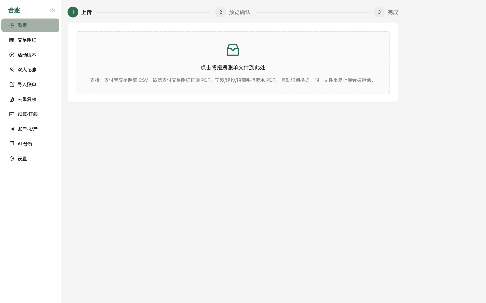
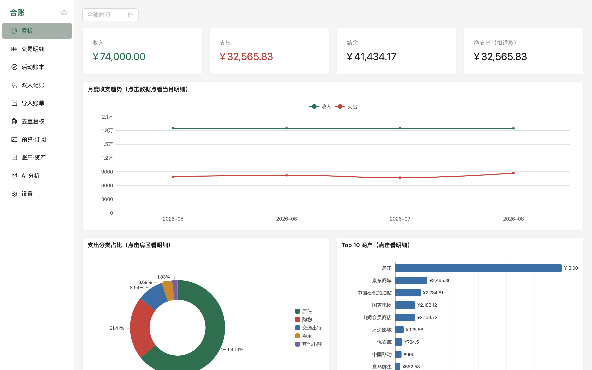
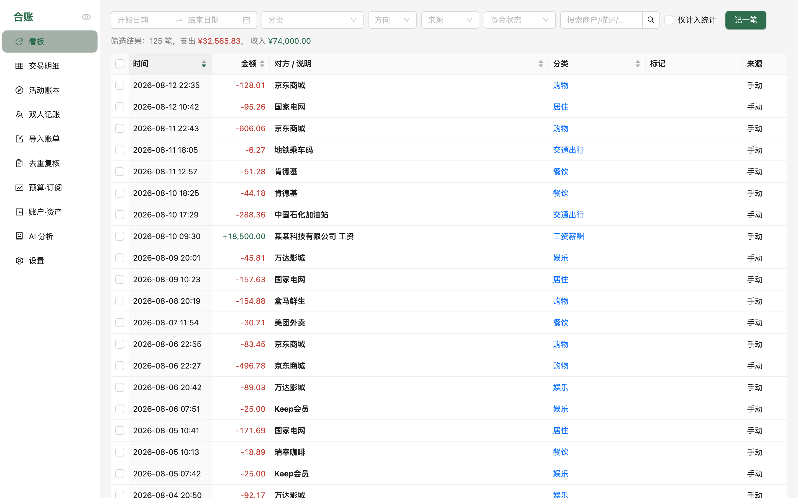

# 使用教程

从零开始，把你的银行卡流水、支付宝、微信账单变成一本清晰的账。全程数据不出你的电脑。

## 目录

- [安装](#安装)
- [第一步：导出账单](#第一步导出账单)
- [第二步：导入](#第二步导入)
- [第三步：去重复核](#第三步去重复核)
- [日常使用](#日常使用)
- [AI 分析（可选）](#ai-分析可选)
- [数据备份与迁移](#数据备份与迁移)
- [常见问题](#常见问题)

## 安装

从 [Releases](../../../releases) 下载对应平台的包：

| 平台 | 操作 |
|---|---|
| **macOS** | 下载 `LedgerFuse-macos-arm64.zip`（M 系列芯片）或 `-x64.zip`（Intel），解压后把 `LedgerFuse.app` 拖进「应用程序」。首次打开如果提示"无法验证开发者"：右键点 App → 打开 → 再点打开（只需一次） |
| **Windows** | 下载 `LedgerFuse-windows-x64.zip`，解压到任意目录，双击 `LedgerFuse.exe`。如果 SmartScreen 拦截：更多信息 → 仍要运行 |
| **Linux** | 下载 `LedgerFuse-linux-x64.tar.gz`，解压后先装 WebView 依赖 `sudo apt install gir1.2-webkit2-4.1`，再运行 `./LedgerFuse/LedgerFuse`。服务器或无桌面环境用 `./LedgerFuse/LedgerFuse --server`，会打印网址用浏览器访问 |

打开后是一个独立窗口，**关掉窗口即完全退出**，没有后台驻留。

## 第一步：导出账单

每个来源的官方导出入口（都是免费的）：

| 来源 | 步骤 | 得到 |
|---|---|---|
| **支付宝** | 手机 APP：我的 → 账单 → 右上角「…」→ 开具交易流水证明 → 选时间范围 → 发送到邮箱 | CSV 文件（zip 里，解压密码在同一封邮件） |
| **微信支付** | 手机 APP：我 → 服务 → 钱包 → 账单 → 常见问题 → 下载账单 → **用于个人对账** → 选时间范围 | 「微信支付交易明细证明」PDF（zip 解压密码在邮件里） |
| **招商银行** | 手机银行：首页搜「交易流水」→ 申请流水 → 发送到邮箱 | PDF |
| **建设银行** | 手机银行：账户 → 明细 → 导出（活期明细） | PDF |
| **宁波银行** | 手机银行：账户明细 → 导出交易流水 | PDF |

建议：**渠道账单（微信/支付宝）和它绑定的银行卡流水都导**，时间范围尽量一致——这样跨账单去重才能发挥全部作用。

> 有密码的 PDF 请先解密再导入（大多数银行流水 PDF 无密码；微信的 zip 解压后 PDF 本身无密码）。

## 第二步：导入

打开「导入账单」页 → 把文件拖进去（一次一个）：

1. 系统自动识别账单类型，解析并和账单**自带的汇总核对**（笔数、收支合计、余额链），有出入会在预览页警告。
2. 预览确认没问题 → 点「确认入库」。
3. 入库后自动跑一遍完整管线：转账识别 → 跨账单去重 → 退款对冲 → 自动分类。

同一个文件重复导入会被自动拦截；账期重叠的两份账单，重叠部分自动跳过，不会重复计账。

## 第三步：去重复核

同一笔消费会同时出现在微信/支付宝账单和银行卡流水里。绝大多数系统能自动配对（以渠道账单为主记录，银行侧标记为重复不计统计）。**拿不准的会进「去重复核」页**，需要你人工确认：

- 每一条是一对交易：左边渠道账单，右边银行流水，附上金额差和日期差。
- 是同一笔 → 点「确认重复」；不是 → 点「不是重复」（银行侧恢复计入统计）。
- 你的裁决永久生效，之后重跑去重不会覆盖。

复核完，看板右上角的「存疑」计数归零，统计口径就干净了。「看板 → 口径对账」卡片能看到从原始金额到计入统计金额的每一步扣减，数字对不上时从这里定位。

## 日常使用

- **看板**：收支总览、月度趋势、分类占比、Top 商户、消费时段热力图。图表都能点击下钻到明细。
- **交易明细**：全字段筛选、关键词搜索、批量改分类/圈活动/标记报销。
  
- **分类规则**：设置页可以添加自己的关键词/正则规则（比如「某小区物业 → 居住/物业」），用户规则永远优先于内置规则。
- **预算·订阅**：按月按分类设预算，超支进度条示警；订阅页自动从"定期支出"里发现候选（如每月固定扣的会员费）。
- **活动账本**：旅行、装修这类专项开销，按日期范围一键圈入，单独看每日花销和分类构成。
- **双人记账**：把某些账户归属给家人（如亲情卡），标记共同支出后自动算「谁多付了多少」。
- **演示模式**：侧栏顶部的眼睛图标，一键隐藏金额和交易对象，截图分享不泄密。

## AI 分析（可选）

完全可选，不配置不影响任何其他功能。

1. 到 [Anthropic Console](https://console.anthropic.com/) 申请 API Key。
2. 设置页粘贴保存（只存你本机的数据库），或设环境变量 `ANTHROPIC_API_KEY`。
3. 「AI 分析」页：
   - **分析报告**：按月/年/全部生成 Markdown 财务分析（TL;DR + 消费结构 + 异常 + 优化建议）。
   - **批量分类**：对未分类交易给出建议，中高置信度自动应用。

隐私边界：AI 只收到**聚合摘要**（分类合计、月度趋势、Top 商户这类），永远不会收到任何一笔原始交易明细。

## 数据备份与迁移

所有数据在一个目录里，复制走就是完整备份：

| 平台 | 数据目录 |
|---|---|
| macOS | `~/Library/Application Support/LedgerFuse` |
| Windows | `%APPDATA%\LedgerFuse` |
| Linux | `~/.local/share/ledgerfuse` |
| 源码运行 | `backend/data/` |

核心是 `bills.db`（SQLite）。换电脑就把整个目录拷到新机器的相同位置。用环境变量 `LEDGERFUSE_DATA_DIR` 可以指到任意位置（比如放进你自己的同步盘）。

也可以在交易明细页导出 CSV / Excel（多 sheet 月报）。

## 常见问题

**打开后白屏或没反应？**
端口 8642 可能被占用。终端跑 `LedgerFuse --server` 看报错；或杀掉旧进程再开。

**导入时提示"无法识别的 PDF 账单格式"？**
目前支持列表见 README。如果你的银行不在列表里，[开个 issue](../../../issues/new/choose) 告诉我们格式特征（**注意脱敏，不要上传真实账单**），或参照 [CONTRIBUTING](../CONTRIBUTING.md) 自己写一个解析器——单个解析器约 110 行。

**统计数字和银行 APP 对不上？**
先看「口径对账」卡片：转账、信用卡消费明细、去重的银行侧影子都不计入统计。再检查「去重复核」是否还有存疑未处理。

**Windows 杀毒软件报毒？**
PyInstaller 打包的程序偶尔被误报。代码全开源可查，介意的话可以从源码运行（见 README「从源码运行」）。

**支付宝 CSV 打开是乱码？**
正常，它是 GB18030 编码，不影响导入。别用 Excel 打开后另存，会破坏编码。
